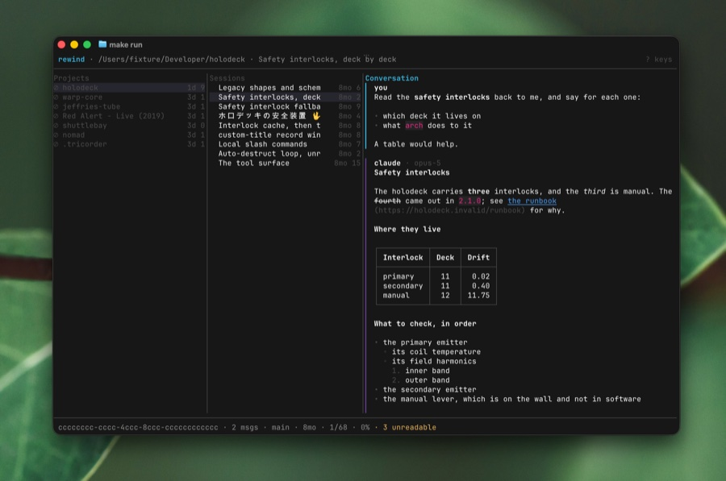

[](https://github.com/otaviocc/rewind/actions/workflows/ci.yml)
[](https://github.com/otaviocc/rewind/releases/latest)
[](https://crates.io/crates/rewind-cli)
[](https://github.com/otaviocc/rewind/blob/main/Cargo.toml)
[](https://github.com/otaviocc/rewind/blob/main/LICENSE)

# rewind

A terminal browser for your Claude Code conversation history.

Claude Code keeps every conversation on disk, but the only way back into one is to remember
which repository you were in, `cd` there, and `--resume` your way through a picker. And if
the working copy is gone, so is the path back, even though the transcript is still there.

`rewind` opens all of it: every project Claude Code has ever seen, the sessions inside each,
and the conversation rendered as something worth reading. It makes no network requests and
never writes to `~/.claude`.



Projects on the left, the sessions inside the selected one in the middle, and the
conversation on the right. Two things mark the column the keyboard is in: its title is in
the accent color, which is `Conversation` in the shot above, and its selected row carries a
solid band. The other columns keep a fainter band on their own selection, so you can still
see where you left each one. `Tab` moves between them.

The status line along the bottom names the selected session, then the focused column's
position and percentage through its rows (nothing worth reading if it only has one). It ends
with the word `focus` when the conversation is filling the terminal on its own, which is
what `f` in the [Keys](#keys) table below does.

In a terminal narrower than 50 characters there is no room for the three columns side by
side, so rewind shows **one of them at a time**, whichever is focused, full width. `Enter`
descends into it, `Esc` goes back, and a column with something behind it carries a `‹`
before its name.

## Install

Homebrew, from my tap:

```
brew install otaviocc/apps/rewind
```

It builds from source, so Homebrew pulls in a Rust toolchain as a build dependency.

From crates.io. The crate is `rewind-cli` and the binary it installs is `rewind`:

```
cargo install rewind-cli --locked
```

Prebuilt archives for Linux and macOS are attached to every
[release](https://github.com/otaviocc/rewind/releases): unpack one and put `rewind` on your
`PATH`.

Or from source, which needs Rust 1.88 or newer:

```
git clone https://github.com/otaviocc/rewind
cd rewind
cargo install --locked --path .
```

## Quick start

```
rewind                     open on every project Claude Code has seen
rewind vademecum           open one project directly
rewind --session <id>      open one conversation directly
```

`Tab` walks Projects → Sessions → Conversation, `Enter` descends into the selected row, and
`q` leaves. A project whose working copy is gone still reads. It shows as `⊘` in the
Projects column, because the transcript survives even when the directory does not. On a
narrow terminal `Enter` and `Esc` do the same walking, one pane at a time.

## Keys

| Key | |
| --- | --- |
| `h` `l` `Tab` `Shift-Tab` `←` `→` | move between columns |
| `j` `k` `↓` `↑` | move within a column |
| `g` `G` `Home` `End` | top · bottom of the column |
| `d` `u` `Ctrl-d` `Ctrl-u` | half page down · up |
| `Enter` | descend · expand the selected tool call · enter a subagent · read a plan |
| `Esc` | leave a subagent · close a plan · back out |
| `f` | focus the conversation full-width |
| `/` | filter the list |
| `s` | search everything |
| `n` `p` `N` | next · previous tool call, or step through a locked `/` filter (`N` is an alias for `p`) |
| `[` `]` | previous · next message |
| `Space` `t` | expand one tool call · all of them |
| `i` | reveal context injections |
| `b` | cycle the alternate branches at the marker |
| `y` `Y` | copy the message · the whole session |
| `c` | copy `claude --resume <id>` |
| `e` | export to a file |
| `D` | what could not be read · `Esc` or `q` closes it |
| `?` `F1` | every key and what it does · `Esc` or `q` closes it |
| `r` | rescan `~/.claude` for new and changed projects |
| `q` `Ctrl-C` | quit; with a window open, `q` closes the window and `Ctrl-C` still quits |

A tool call marked `⏎` has something behind it: a subagent to enter, or, on the call that
ends plan mode, the plan itself. `Space` expands the call in place and shows the plan's
opening; `Enter` opens the whole thing in its own scrollable window, and `Esc` or `q` closes
it again.

The `/` filter and the `e` export prompt take typing: letters type instead of acting,
`Backspace` deletes, `↑`/`↓` still move, `Enter` accepts, and `Esc` cancels. In the export
prompt, `Tab` cycles the format between Markdown and JSONL.

Mouse wheel scrolls whichever column is under the pointer, not whichever has focus. Clicking
a row selects it, clicking a collapsed tool call expands it, and clicking a subagent call
enters it. Dragging in the conversation selects its lines and copies them to the clipboard
on release. `--no-mouse` turns capture off.

## Searching

`s` opens a search over every project, ranking hits as you type; `Enter` opens the
selected one, switching to the branch the hit is on, stopping on the line that carries the
term and marking it there. The mark stays until your next keypress, so a hit in a long
message is a glance rather than a hunt.

| | |
| --- | --- |
| `bare terms` | AND together |
| `"a phrase"` | matched whole |
| `-term` | excludes it |
| `is:user` `is:assistant` `is:tool` `is:thinking` `is:history` `is:any` | restrict to one kind of text |
| `project:name` | restrict to one project |

Anything else is a literal term.

A search with no `is:` looks only at what a human or the assistant wrote in a conversation.
Everything else is indexed too, but it is bulky and would otherwise crowd the conversation
out, so you reach it by asking: `is:tool` for tool parameters and output, `is:thinking` for
the model's reasoning, `is:history` for the prompt log, or `is:any` for all of it at once.

`is:history` searches `~/.claude/history.jsonl`, which is every prompt you have ever typed.
It outlives the transcripts, since most of its entries belong to sessions that have since
been cleaned up, so a hit there often has no conversation left to open. That is also why it is
worth searching when nothing else turns your prompt up.

Search is backed by a corpus rewind keeps under `$XDG_CACHE_HOME/rewind`, or
`~/.cache/rewind` if that variable is unset. It builds in the background and is searchable
while it is still filling. The overlay shows `indexing…`, then marks results `(partial)`
until the corpus is complete. The project and session lists never wait on it.
`--no-cache` ignores the cache and does not write it; `--rebuild-cache` discards it and
rebuilds from scratch, then exits.

## Themes

Fourteen themes are built in. `spool` is the default, written for `rewind` rather than
borrowed from an editor, and it leaves the background and foreground alone so a transcript
sits on your own terminal ground. `ansi` is the other end: it asserts no color at all and
takes everything from your terminal's scheme.

```
spool             ansi              catppuccin-latte
catppuccin-mocha  default-plus      gruvbox-dark
gruvbox-light     kanagawa-dragon   nord
solarized-dark    solarized-light   tokyo-night
tokyo-night-day   vesper
```

`--theme <name>` picks one, `--list-themes` prints them.

To change anything, `rewind` reads one file. On every platform, including macOS, it lives at
`$XDG_CONFIG_HOME/rewind/theme.toml`, or `~/.config/rewind/theme.toml` if that variable is
unset. Named themes go beside it in `themes/<name>.toml` and are selected with `--theme`.

Everything is optional. A theme states what it wants moved and inherits the rest, so this is
a complete and valid file:

```toml
[palette]
accent = "#89b4fa"
```

[`docs/THEMES.md`](docs/THEMES.md) is the rest: every palette slot and what it drives, the
element keys and their modifiers, inheriting from another theme with `base`, choosing the
syntax highlighting, and what a typo costs you.

## Flags

| Flag | |
| --- | --- |
| `[PROJECT]` | open this project first |
| `--session <ID>` | open a session directly |
| `--theme <NAME>` | theme by name |
| `--config <FILE>` | explicit theme file |
| `--list-themes` | list built-in and user themes, then exit |
| `--claude-dir <DIR>` | override `~/.claude` |
| `--no-mouse` | disable mouse capture |
| `--no-cache` | ignore and do not write the cache |
| `--rebuild-cache` | discard the cache and rebuild, then exit |
| `--color <WHEN>` | `auto`, `always` or `never` |
| `--help` `--version` | usage and version, then exit |

## Privacy

`rewind` makes no network requests, ever, and never writes to `~/.claude`, ever. The only
things it writes anywhere are its own search cache under `~/.cache/rewind` and whatever `e`
exports to the file you name.

## License

MIT.
